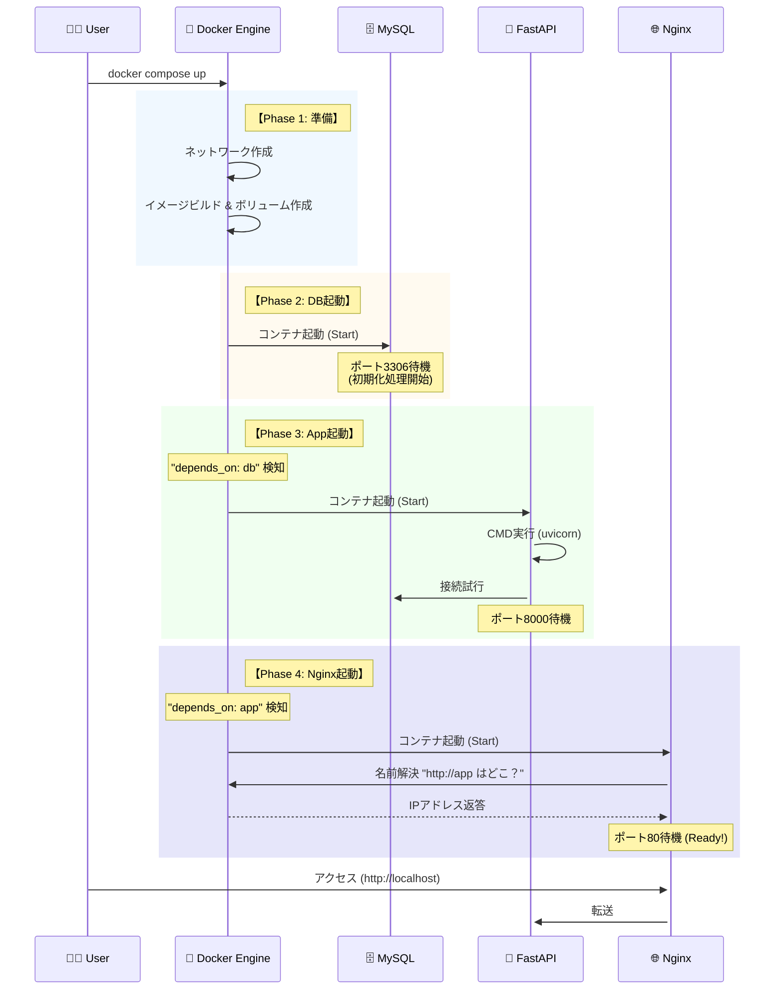

# 🚀 FastAPI + Docker 開発環境構築 & 起動ガイド

このドキュメントは、Mac (Colima) 環境における FastAPI, MySQL, Nginx の Docker 構築手順と、起動時の内部フローをまとめたものです。

---

## 🛠 1. 開発環境構築フロー

### 1-1. 前提環境 (Mac + Colima)
Docker Desktopの代わりにColimaを使用する場合、DB安定化のためにリソースを確保して起動します。


### 1-2. ディレクトリ構成
プロジェクトルート (\`food-app-backend\`) を作成し、以下の構成にします。

```text
food-app-backend/
├── nginx/
│   └── default.conf     # Webサーバー設定
├── app/                 # 機能ベース構成への移行を見据えた配置
│   └── main.py          # アプリ本体
├── requirements.txt     # ライブラリ一覧
├── Dockerfile           # FastAPI用コンテナ定義
└── docker-compose.yml   # 全体の構成定義
```

### 1-3. 主要ファイルの記述内容

#### Dockerfile
```dockerfile
FROM python:3.12-slim

ENV PYTHONDONTWRITEBYTECODE=1
ENV PYTHONUNBUFFERED=1

WORKDIR /app

COPY requirements.txt .
RUN pip install --no-cache-dir -r requirements.txt

COPY . .

# Nginx経由のため8000番で待機
CMD ["uvicorn", "app.main:app", "--host", "0.0.0.0", "--port", "8000", "--reload"]
```

#### docker-compose.yml
```yaml
version: '3.8'

services:
  db:
    image: mysql:8.0
    container_name: food_app_db
    environment:
      MYSQL_DATABASE: food_db
      MYSQL_USER: user
      MYSQL_PASSWORD: password
      MYSQL_ROOT_PASSWORD: root_password
    ports:
      - "3306:3306"
    volumes:
      - db_data:/var/lib/mysql

  app:
    build: .
    container_name: food_app_server
    volumes:
      - .:/app
    environment:
      DATABASE_URL: mysql+pymysql://user:password@db/food_db
    depends_on:
      - db

  nginx:
    image: nginx:latest
    container_name: food_app_nginx
    ports:
      - "80:80"
    volumes:
      - ./nginx/default.conf:/etc/nginx/conf.d/default.conf
    depends_on:
      - app

volumes:
  db_data:
```
---

## 🌊 2. 起動シーケンス詳細フロー

コマンド実行からリクエスト受付開始までの内部処理フローです。

**起動コマンド:**
```bash
docker compose up --build
```

### シーケンス図



### ステップ解説

1.  **Phase 1: インフラ準備**
    * Dockerが仮想ネットワークを作成し、コンテナ同士が名前（`db`, `app`）で通信できるようにする。

2.  **Phase 2: DB (MySQL) 起動**
    * `depends_on` の制約がないため最初に起動。
    * コンテナ起動直後はデータ初期化処理が走るため、数秒間は接続を受け付けない場合がある。

3.  **Phase 3: App (FastAPI) 起動**
    * Dockerが「DBコンテナ開始」を検知して起動。
    * `CMD` コマンドでUvicornサーバーが立ち上がる。
    * 起動時にDBへの接続を試みる。

4.  **Phase 4: Nginx 起動**
    * Dockerが「Appコンテナ開始」を検知して起動。
    * 設定ファイル (`default.conf`) を読み込み、`http://app:8000` への転送準備を完了する。
    * ポート80を開放し、ブラウザからのアクセス待ち状態になる。

---

## ✅ 3. 動作確認

ブラウザで以下のURLにアクセスして確認します。

* **API稼働確認:** [http://localhost/](http://localhost/)
* **DB接続テスト:** [http://localhost/db-check](http://localhost/db-check)
* **APIドキュメント:** [http://localhost/docs](http://localhost/docs)
EOF