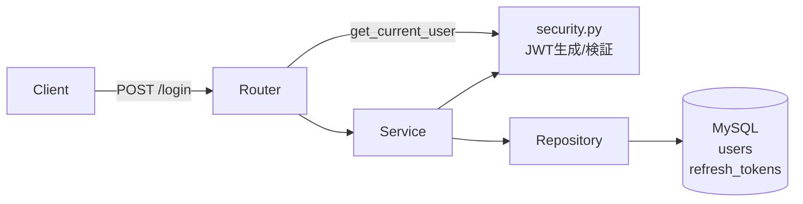
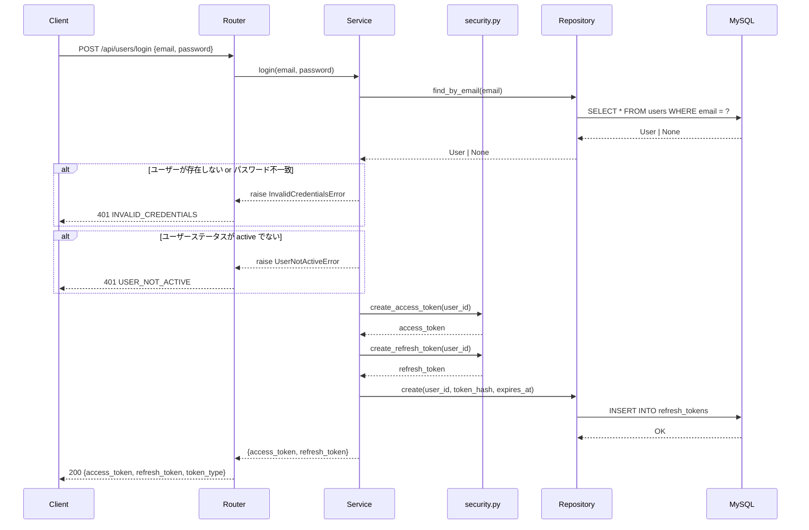
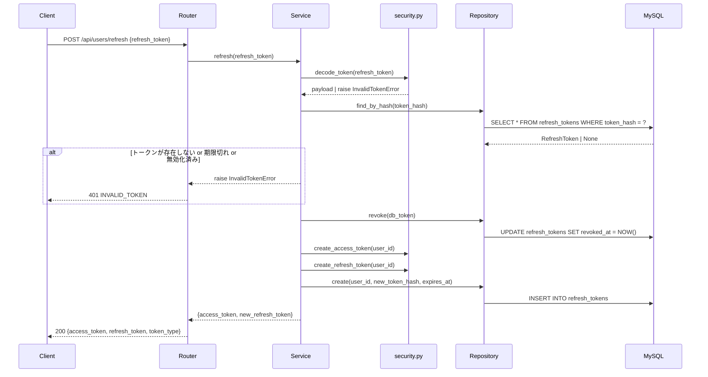

# 認証機能 設計書

> 要件定義（Why/What）は [requirements.md](requirements.md) を参照。
> 本ドキュメントは実装レベルの技術仕様を記載しています。

## 目次

- [概要](#概要)
- [アーキテクチャ概要](#アーキテクチャ概要)
- [技術選定](#技術選定)
- [コンポーネント設計](#コンポーネント設計)
- [データフロー](#データフロー)
  - [ログインフロー](#ログインフロー)
  - [トークン更新フロー](#トークン更新フロー)
- [エンドポイント](#エンドポイント)
- [リクエスト・レスポンス仕様](#リクエストレスポンス仕様)
  - [POST /api/users/login](#post-apiuserslogin)
  - [POST /api/users/refresh](#post-apiusersrefresh)
  - [POST /api/users/logout](#post-apiuserslogout)
  - [GET /api/users/me](#get-apiusersme)
- [エラーハンドリング方針](#エラーハンドリング方針)
- [データベース設計](#データベース設計)
  - [refresh_tokens テーブル](#refresh_tokens-テーブル)
- [設定値](#設定値)
- [テスト戦略](#テスト戦略)
- [制約事項](#制約事項)
- [ファイル構成](#ファイル構成)
- [Gate2 チェックリスト](#gate2-チェックリスト)

---

## 概要

JWT + OAuth2 Password Flow によるログイン処理を実装する。

---

## アーキテクチャ概要



---

## 技術選定

| 技術 | 選定理由 | 不採用の代替案 |
|------|---------|--------------|
| JWT + OAuth2 Password Flow | ステートレスな認証で水平スケールが容易。FastAPIのOAuth2PasswordBearerと標準統合できる | セッションベース認証（DBへの全リクエストアクセスが必要でパフォーマンス不利） |
| リフレッシュトークンのDB保存 | サーバー側でトークンを即時無効化できる（強制ログアウト対応） | JWTのみ（有効期限前のトークン無効化が不可能） |
| slowapi（レート制限） | FastAPIと相性が良く、設定が簡潔 | fastapi-limiter（Redisが必要でインフラ複雑化）、手動実装（メンテコスト高） |
| bcrypt（パスワードハッシュ） | 計算コストが調整可能でブルートフォース耐性が高い | SHA-256（ソルトなしの実装ではレインボーテーブル攻撃に脆弱） |
| 同期実装（def） | 現在のユーザー規模では十分。DB接続に同期ドライバ（PyMySQL）を使用 | asyncio実装（aiomysqlが必要で複雑化） |

---

## コンポーネント設計

### 責務一覧

| ファイル | 責務 |
|---------|------|
| `router.py` | エンドポイント定義、リクエストのバリデーション受け取り、レスポンス返却 |
| `service.py` | ビジネスロジック（認証フロー全体の制御、トークン発行判定） |
| `repository.py` | DB操作の抽象化（ユーザー検索、トークン保存・無効化） |
| `security.py` | JWT生成・検証、パスワードハッシュ・検証 |
| `schemas.py` | リクエスト/レスポンスのPydanticモデル定義 |
| `models.py` | SQLAlchemyモデル（User, RefreshToken） |
| `exceptions.py` | 認証固有の例外クラス定義 |

### 依存方向

```
router.py → service.py → repository.py → DB
          →            → security.py
```

`security.py` は `service.py` から呼ばれるほか、`router.py` からも `get_current_user`（依存性注入用）として直接利用する。

---

## データフロー

### ログインフロー



### トークン更新フロー



---

## エンドポイント

| メソッド | パス | 説明 | 認証 | レート制限 |
|---------|------|------|:----:|:---------:|
| POST | `/api/users/register` | ユーザー登録 | 不要 | あり |
| POST | `/api/users/login` | ログイン | 不要 | あり |
| POST | `/api/users/refresh` | トークン更新 | 不要 | あり |
| POST | `/api/users/logout` | ログアウト | 必要 | なし |
| GET | `/api/users/me` | 現在のユーザー情報 | 必要 | なし |

---

## リクエスト・レスポンス仕様

### POST /api/users/register

**リクエスト**
```json
{
  "username": "太郎",
  "email": "user@example.com",
  "password": "password123"
}
```

**レスポンス（成功: 200）**
```json
{
  "access_token": "eyJhbGciOiJIUzI1NiIs...",
  "refresh_token": "eyJhbGciOiJIUzI1NiIs...",
  "token_type": "bearer"
}
```

**エラーレスポンス（400: メールアドレス重複）**
```json
{
  "error_code": "USER_ALREADY_EXISTS",
  "message": "このメールアドレスは既に登録されています",
  "details": null
}
```

---

### POST /api/users/login

**リクエスト**
```json
{
  "email": "user@example.com",
  "password": "password123"
}
```

**レスポンス（成功: 200）**
```json
{
  "access_token": "eyJhbGciOiJIUzI1NiIs...",
  "refresh_token": "eyJhbGciOiJIUzI1NiIs...",
  "token_type": "bearer"
}
```

**エラーレスポンス（401）**
```json
{
  "error_code": "INVALID_CREDENTIALS",
  "message": "メールアドレスまたはパスワードが正しくありません",
  "details": null
}
```

**エラーレスポンス（429: レート制限）**
```json
{
  "error_code": "RATE_LIMIT_EXCEEDED",
  "message": "リクエスト回数が上限に達しました。しばらくお待ちください",
  "details": null
}
```

---

### POST /api/users/refresh

**リクエスト**
```json
{
  "refresh_token": "eyJhbGciOiJIUzI1NiIs..."
}
```

**レスポンス（成功: 200）**
```json
{
  "access_token": "eyJhbGciOiJIUzI1NiIs...",
  "refresh_token": "eyJhbGciOiJIUzI1NiIs...",
  "token_type": "bearer"
}
```

**エラーレスポンス（401）**
```json
{
  "error_code": "INVALID_TOKEN",
  "message": "トークンが無効または期限切れです",
  "details": null
}
```

---

### POST /api/users/logout

**ヘッダー**
```
Authorization: Bearer <access_token>
```

**レスポンス（成功: 200）**
```json
{
  "message": "ログアウトしました"
}
```

---

### GET /api/users/me

**ヘッダー**
```
Authorization: Bearer <access_token>
```

**レスポンス（成功: 200）**
```json
{
  "id": "550e8400-e29b-41d4-a716-446655440000",
  "username": "太郎",
  "email": "taro@example.com",
  "status": "active"
}
```

**エラーレスポンス（401）**
```json
{
  "error_code": "INVALID_TOKEN",
  "message": "トークンが無効または期限切れです",
  "details": null
}
```

---

## エラーハンドリング方針

### エラー分類と対応 HTTP ステータス

| 分類 | HTTPステータス | error_code | 発生状況 |
|------|:-------------:|------------|---------|
| 認証情報不正 | 401 | `INVALID_CREDENTIALS` | メール/パスワード不一致 |
| アカウント無効 | 401 | `USER_NOT_ACTIVE` | ユーザーステータスが active でない |
| トークン無効 | 401 | `INVALID_TOKEN` | JWTが不正・期限切れ・無効化済み |
| メールアドレス重複 | 400 | `USER_ALREADY_EXISTS` | 登録済みのメールアドレスで register |
| レート制限超過 | 429 | `RATE_LIMIT_EXCEEDED` | slowapiによるリクエスト制限 |
| バリデーションエラー | 422 | -（FastAPIデフォルト） | リクエストの形式・型エラー |
| サーバーエラー | 500 | `INTERNAL_ERROR` | 予期しない例外 |

### エラーレスポンス共通フォーマット

```json
{
  "error_code": "ERROR_CODE_STRING",
  "message": "ユーザー向けの説明（日本語）",
  "details": null
}
```

- `details` フィールドは追加情報がある場合のみ使用（通常は `null`）
- 認証エラーでは内部の詳細情報を露出しない（例: 「ユーザーが存在しない」と「パスワードが違う」を区別しない）

---

## データベース設計

### refresh_tokens テーブル

| カラム | 型 | 説明 |
|--------|------|------|
| id | CHAR(36) | UUID（主キー） |
| user_id | CHAR(36) | FK → users.id |
| token_hash | VARCHAR(255) | トークン値（ハッシュ化済み） |
| expires_at | DATETIME | 有効期限 |
| revoked_at | DATETIME | 無効化日時（nullable） |
| created_at | DATETIME | 作成日時 |

**インデックス**
- `token_hash`（トークン検索用）
- `user_id`（ユーザー別検索用）

---

## 設定値

| 設定項目 | 環境変数 | デフォルト値 |
|---------|---------|-------------|
| JWT秘密鍵 | `JWT_SECRET_KEY` | （必須） |
| JWTアルゴリズム | - | HS256 |
| アクセストークン有効期限 | - | 30分 |
| リフレッシュトークン有効期限 | - | 7日 |
| ログインレート制限 | - | 5回/分 |

---

## テスト戦略

### ユニットテスト（`service.py` / `security.py`）

| テスト対象 | 正常系 | 異常系 |
|-----------|--------|--------|
| JWT生成・検証 | 有効なトークン生成、ペイロード検証 | 期限切れ、改ざんトークン |
| パスワードハッシュ・検証 | 正しいパスワードの検証 | 誤ったパスワードの検証 |
| login() | 正常ログイン | ユーザー未存在、パスワード不一致 |
| refresh() | 正常更新 | 無効トークン、期限切れ、無効化済み |

### 統合テスト（各エンドポイント）

| エンドポイント | 正常系 | 異常系 |
|--------------|--------|--------|
| POST /login | 200 + トークン返却 | 401（認証失敗）、429（レート制限） |
| POST /refresh | 200 + 新トークン返却 | 401（無効トークン） |
| POST /logout | 200 | 401（未認証） |
| GET /me | 200 + ユーザー情報 | 401（未認証・期限切れ） |

### テストデータ管理方針

- テスト用ユーザーはフィクスチャで管理
- リフレッシュトークンはテスト後にクリーンアップ
- レート制限テストはキャッシュリセットを前提に実施

---

## 制約事項

### セキュリティ制約

1. **パスワード**: bcryptでハッシュ化して保存（平文保存禁止）
2. **リフレッシュトークン**: DBにはハッシュ値のみ保存（原本は返却後に破棄）
3. **レート制限**: 登録・ログイン・リフレッシュエンドポイントに5回/分を適用
4. **トークン検証**: 署名検証 + 有効期限チェック + DB照合（revoked_at確認）
5. **ログアウト**: リフレッシュトークンをDBで即時無効化（revoked_atをセット）
6. **エラーメッセージ**: 認証エラーの詳細（ユーザー存在有無など）を外部に漏洩しない

### パフォーマンス制約

- ログイン・トークン更新は 500ms 以内に応答
- bcryptのコスト係数はレスポンスタイムとセキュリティのバランスで調整

### 可用性制約

- 認証機能の障害はアプリ全体の利用不能に直結するため、他機能と同等以上の安定性を確保する

---

## ファイル構成

```
app/
├── core/
│   ├── config.py          # 設定値管理
│   └── security.py        # JWT・パスワード処理
└── features/
    └── users/
        ├── models.py      # User, RefreshToken モデル
        ├── schemas.py     # Pydantic スキーマ
        ├── repository.py  # DB操作
        ├── service.py     # ビジネスロジック
        ├── router.py      # エンドポイント定義
        └── exceptions.py  # 認証固有の例外
```

---

## Gate2 チェックリスト

- [ ] アーキテクチャ概要図（Mermaid）が記載されている
- [ ] 技術選定に選定理由と不採用代替案が記載されている
- [ ] 全コンポーネントの責務と依存方向が明記されている
- [ ] ログイン・トークン更新のsequenceDiagramが記載されている
- [ ] 全エンドポイントのリクエスト/レスポンス例（JSON）が記載されている
- [ ] エラーハンドリング方針とエラーレスポンスフォーマットが定義されている
- [ ] DBテーブル定義とインデックスが記載されている
- [ ] テスト戦略（ユニット・統合）が記載されている
- [ ] セキュリティ制約とパフォーマンス制約が明記されている
- [ ] requirements.md へのリンクが設置されている
