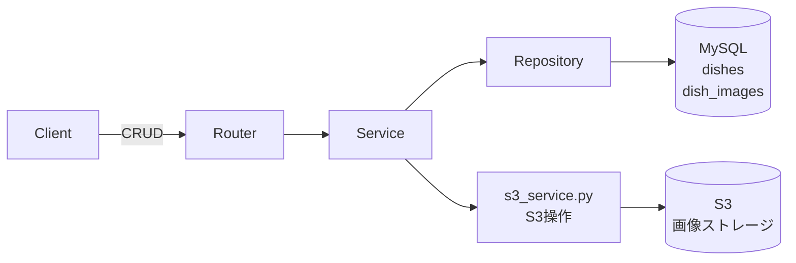
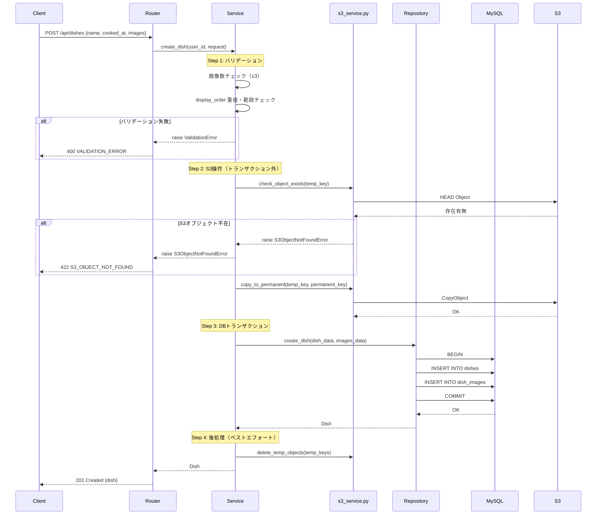
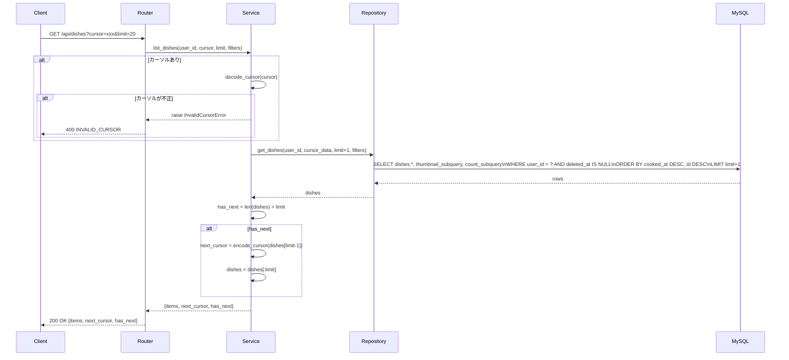

# 料理（Dish）CRUD API 設計書

> 要件定義（Why/What）は [requirements.md](requirements.md) を参照。
> 本ドキュメントは実装レベルの技術仕様を記載しています。

## 目次

- [1. 概要](#1-概要)
- [2. アーキテクチャ概要](#2-アーキテクチャ概要)
- [3. 技術選定](#3-技術選定)
- [4. コンポーネント設計](#4-コンポーネント設計)
- [5. データフロー](#5-データフロー)
  - [5.1 料理登録フロー（S3含む）](#51-料理登録フローs3含む)
  - [5.2 料理一覧取得フロー](#52-料理一覧取得フロー)
- [6. 共通仕様](#6-共通仕様)
  - [認証](#認証)
  - [アクセス制御](#アクセス制御)
  - [ベースパス](#ベースパス)
- [7. エンドポイント一覧](#7-エンドポイント一覧)
- [8. 各エンドポイント詳細](#8-各エンドポイント詳細)
  - [8.1 POST /api/dishes - 料理登録](#81-post-apidishes---料理登録)
  - [8.2 GET /api/dishes - 料理一覧取得](#82-get-apidishes---料理一覧取得)
  - [8.3 GET /api/dishes/{id} - 料理詳細取得](#83-get-apidishesid---料理詳細取得)
  - [8.4 PUT /api/dishes/{id} - 料理更新](#84-put-apidishesid---料理更新)
  - [8.5 DELETE /api/dishes/{id} - 料理削除](#85-delete-apidishesid---料理削除)
- [9. エラーハンドリング方針](#9-エラーハンドリング方針)
- [10. error_code 一覧](#10-error_code-一覧)
- [11. Pydanticスキーマ設計](#11-pydanticスキーマ設計)
  - [リクエストスキーマ](#リクエストスキーマ)
  - [レスポンススキーマ](#レスポンススキーマ)
- [12. カーソルのエンコード・デコード](#12-カーソルのエンコードデコード)
- [13. テスト戦略](#13-テスト戦略)
- [14. 制約事項](#14-制約事項)
- [15. 実装ファイル構成](#15-実装ファイル構成)
- [Gate2 チェックリスト](#gate2-チェックリスト)

---

## 1. 概要

ユーザーが自分の料理を登録・取得・更新・削除するためのAPI仕様。

---

## 2. アーキテクチャ概要



---

## 3. 技術選定

| 技術・方式 | 選定理由 | 不採用の代替案 |
|-----------|---------|--------------|
| カーソルベースページネーション | 大量データでも安定したパフォーマンス。途中に追加・削除があっても重複・欠落が発生しない | オフセット方式（`LIMIT/OFFSET`）: 件数が増えるほど遅くなり、ページ間でデータがズレる |
| 差分更新方式（PUT） | 変更しない画像を再送不要。ネットワーク効率が高く、意図しない画像削除を防ぐ | 全置換方式: 未変更の画像も含めて毎回全件送信が必要で、通信量・S3操作が増大 |
| 論理削除 | 削除後も復元可能。監査ログとして機能する | 物理削除: 復元不可能で、参照整合性エラーのリスクがある |
| S3操作をDBトランザクション外で先行実行 | DBが参照するファイルが存在しないという致命的な不整合を防ぐ | トランザクション内での一括処理: S3はACIDに非対応のためロールバック不可 |

---

## 4. コンポーネント設計

### 責務一覧

| ファイル | 責務 |
|---------|------|
| `router.py` | エンドポイント定義、リクエスト受け取り、レスポンス返却 |
| `service.py` | ビジネスロジック（バリデーション、S3操作とDB操作の制御） |
| `repository.py` | DB操作の抽象化（Dish/DishImageのCRUD） |
| `s3_service.py` | S3操作（画像の存在確認、一時領域→正式パスへのコピー、削除） |
| `schemas.py` | リクエスト/レスポンスのPydanticモデル定義 |
| `models.py` | SQLAlchemyモデル（Dish, DishImage, DishCategory） |
| `exceptions.py` | 機能固有の例外クラス定義 |

### 依存方向

```
router.py → service.py → repository.py → DB
                       → s3_service.py → S3
```

---

## 5. データフロー

### 5.1 料理登録フロー（S3含む）



### 5.2 料理一覧取得フロー



---

## 6. 共通仕様

### 認証

全エンドポイントで認証必須。

```
Authorization: Bearer <access_token>
```

### アクセス制御

- ユーザーは自分が登録した料理のみ操作可能
- 他ユーザーの料理へのアクセスは403エラー

### ベースパス

```
/api/dishes
```

---

## 7. エンドポイント一覧

| メソッド | パス | 説明 | 認証 |
|---------|------|------|:----:|
| POST | `/api/dishes` | 料理登録 | 必要 |
| GET | `/api/dishes` | 料理一覧取得 | 必要 |
| GET | `/api/dishes/{id}` | 料理詳細取得 | 必要 |
| PUT | `/api/dishes/{id}` | 料理更新 | 必要 |
| DELETE | `/api/dishes/{id}` | 料理削除（論理削除） | 必要 |

---

## 8. 各エンドポイント詳細

### 8.1 POST /api/dishes - 料理登録

#### リクエスト

**ヘッダー**
```
Authorization: Bearer <access_token>
Content-Type: application/json
```

**ボディ**
```json
{
  "name": "カレーライス",
  "cooked_at": "2024-01-15",
  "category_id": "550e8400-e29b-41d4-a716-446655440001",
  "images": [
    {
      "image_key": "images/dishes/temp/abc123.jpg",
      "display_order": 1
    },
    {
      "image_key": "images/dishes/temp/def456.jpg",
      "display_order": 2
    }
  ]
}
```

| フィールド | 型 | 必須 | 制約 | 説明 |
|-----------|------|:----:|------|------|
| name | string | Yes | 1-200文字 | 料理名 |
| cooked_at | string (date) | Yes | YYYY-MM-DD形式 | 作った日 |
| category_id | string (UUID) | No | 有効なUUID | カテゴリID |
| images | array | No | 最大3件 | 画像情報配列 |
| images[].image_key | string | Yes | 1-200文字 | S3一時オブジェクトキー |
| images[].display_order | integer | Yes | 1-3 | 表示順序 |

#### レスポンス

**成功: 201 Created**
```json
{
  "id": "550e8400-e29b-41d4-a716-446655440000",
  "name": "カレーライス",
  "cooked_at": "2024-01-15",
  "category": {
    "id": "550e8400-e29b-41d4-a716-446655440001",
    "name": "和食"
  },
  "images": [
    {
      "id": "660e8400-e29b-41d4-a716-446655440001",
      "image_url": "https://d1234567890.cloudfront.net/images/dishes/550e8400-e29b-41d4-a716-446655440000/1.jpg",
      "display_order": 1
    },
    {
      "id": "660e8400-e29b-41d4-a716-446655440002",
      "image_url": "https://d1234567890.cloudfront.net/images/dishes/550e8400-e29b-41d4-a716-446655440000/2.jpg",
      "display_order": 2
    }
  ],
  "created_at": "2024-01-15T10:30:00Z",
  "updated_at": "2024-01-15T10:30:00Z"
}
```

#### エラーレスポンス

| HTTPステータス | error_code | 条件 |
|:-------------:|------------|------|
| 400 | `VALIDATION_ERROR` | 入力値が不正 |
| 400 | `IMAGE_LIMIT_EXCEEDED` | 画像が3枚を超過 |
| 400 | `INVALID_DISPLAY_ORDER` | display_orderが重複または範囲外 |
| 401 | `INVALID_TOKEN` | トークンが無効または期限切れ |
| 422 | `CATEGORY_NOT_FOUND` | 指定されたカテゴリが存在しない |
| 422 | `IMAGE_NOT_FOUND` | 指定されたS3オブジェクトが存在しない |

**エラー例**
```json
{
  "error_code": "IMAGE_LIMIT_EXCEEDED",
  "message": "画像は最大3枚まで登録できます",
  "details": null
}
```

#### S3画像処理フロー

1. クライアントが事前にS3の一時領域（`images/dishes/temp/`）に画像をアップロード
2. APIリクエストで`image_key`（一時キー）を送信
3. サーバー側処理:

   **Step 1: バリデーション**
   - 画像数が3枚以内か確認
   - display_orderの重複・範囲チェック
   - 失敗時 → `400 VALIDATION_ERROR`

   **Step 2: S3操作（トランザクション外）**
   - S3一時領域の画像存在確認
   - 失敗時 → `422 S3_OBJECT_NOT_FOUND`（DBに影響なし）
   - 正式パス（`images/dishes/{dish_id}/{display_order}.jpg`）にコピー
   - 失敗時 → `500 Internal Error`（DBに影響なし、一時ファイルは24h後に自動削除）

   **Step 3: DBトランザクション**
   - BEGIN
   - dishesテーブルにINSERT
   - dish_imagesテーブルにINSERT
   - COMMIT
   - 失敗時 → ROLLBACK、`500 Internal Error`
     （S3にコピー済みファイルが孤立するが、定期バッチで削除）

   **Step 4: 後処理（非同期・ベストエフォート）**
   - 一時ファイルを削除
   - 失敗しても問題なし（ライフサイクルで24h後に自動削除）

> **設計原則**: S3操作をDBトランザクション外で先に実行することで、「DBが参照するファイルが存在しない」という致命的な不整合を防ぐ。S3のゴミ（孤立ファイル）は許容し、定期バッチで回収する。詳細は `s3-image-upload.md` の「障害パターンとリカバリ」を参照。

---

### 8.2 GET /api/dishes - 料理一覧取得

#### リクエスト

**ヘッダー**
```
Authorization: Bearer <access_token>
```

**クエリパラメータ**

| パラメータ | 型 | 必須 | デフォルト | 説明 |
|-----------|------|:----:|:----------:|------|
| limit | integer | No | 20 | 取得件数（1-100） |
| cursor | string | No | null | ページネーションカーソル |
| category_id | string (UUID) | No | null | カテゴリでフィルタ |
| from_date | string (date) | No | null | cooked_at開始日 |
| to_date | string (date) | No | null | cooked_at終了日 |

#### カーソルベースページネーション

**カーソル形式**

Base64エンコードされたJSON:
```json
{
  "cooked_at": "2024-01-15",
  "id": "550e8400-e29b-41d4-a716-446655440000"
}
```

**ソート順序**
1. `cooked_at DESC` (新しい順)
2. `id DESC` (同日の場合の一意性保証)

**クエリ条件**
```sql
WHERE user_id = :user_id
  AND deleted_at IS NULL
  AND (
    cooked_at < :cursor_cooked_at
    OR (cooked_at = :cursor_cooked_at AND id < :cursor_id)
  )
ORDER BY cooked_at DESC, id DESC
LIMIT :limit + 1  -- 次ページ有無判定用
```

**次ページ判定**
- `limit + 1`件取得し、`limit`件を超えたら次ページあり
- 次ページがある場合、最後のアイテムから`next_cursor`を生成

#### レスポンス

**成功: 200 OK**
```json
{
  "items": [
    {
      "id": "550e8400-e29b-41d4-a716-446655440000",
      "name": "カレーライス",
      "cooked_at": "2024-01-15",
      "category": {
        "id": "550e8400-e29b-41d4-a716-446655440001",
        "name": "和食"
      },
      "thumbnail_url": "https://d1234567890.cloudfront.net/images/dishes/550e8400/1.jpg",
      "image_count": 2,
      "created_at": "2024-01-15T10:30:00Z"
    }
  ],
  "next_cursor": "eyJjb29rZWRfYXQiOiIyMDI0LTAxLTE0IiwiaWQiOiI1NTBlODQwMC4uLiJ9",
  "has_next": true
}
```

| フィールド | 型 | 説明 |
|-----------|------|------|
| items | array | 料理リスト |
| items[].thumbnail_url | string \| null | 最初の画像URL（display_order=1）、画像がない場合null |
| items[].image_count | integer | 画像枚数 |
| next_cursor | string \| null | 次ページ取得用カーソル（次ページがない場合null） |
| has_next | boolean | 次ページの有無 |

#### エラーレスポンス

| HTTPステータス | error_code | 条件 |
|:-------------:|------------|------|
| 400 | `VALIDATION_ERROR` | パラメータが不正 |
| 400 | `INVALID_CURSOR` | カーソルが不正 |
| 401 | `INVALID_TOKEN` | トークンが無効または期限切れ |

#### 実装ノート: パフォーマンス最適化

`thumbnail_url` と `image_count` は `dish_images` テーブルから計算が必要。
N+1問題を回避するため、SQLサブクエリで取得すること。

**推奨実装（SQLAlchemy）:**

```python
from sqlalchemy import func, select, and_
from sqlalchemy.orm import joinedload

# サブクエリ: display_order=1 の image_key を取得
thumbnail_subquery = (
    select(DishImage.image_key)
    .where(
        and_(
            DishImage.dish_id == Dish.id,
            DishImage.display_order == 1
        )
    )
    .correlate(Dish)
    .scalar_subquery()
)

# サブクエリ: 画像の件数を取得
count_subquery = (
    select(func.count(DishImage.id))
    .where(DishImage.dish_id == Dish.id)
    .correlate(Dish)
    .scalar_subquery()
)

# メインクエリ
results = (
    db.query(
        Dish,
        thumbnail_subquery.label("thumbnail_key"),
        count_subquery.label("image_count")
    )
    .options(joinedload(Dish.category))
    .filter(Dish.user_id == user_id)
    .filter(Dish.deleted_at.is_(None))
    .order_by(Dish.cooked_at.desc(), Dish.id.desc())
    .limit(limit + 1)
    .all()
)
```

**発行されるSQL（1クエリ）:**

```sql
SELECT
    dishes.*,
    (SELECT image_key FROM dish_images
     WHERE dish_id = dishes.id AND display_order = 1) AS thumbnail_key,
    (SELECT COUNT(*) FROM dish_images
     WHERE dish_id = dishes.id) AS image_count
FROM dishes
LEFT JOIN dish_categories ON dishes.category_id = dish_categories.id
WHERE dishes.user_id = :user_id
  AND dishes.deleted_at IS NULL
ORDER BY dishes.cooked_at DESC, dishes.id DESC
LIMIT 21;
```

---

### 8.3 GET /api/dishes/{id} - 料理詳細取得

#### リクエスト

**ヘッダー**
```
Authorization: Bearer <access_token>
```

**パスパラメータ**

| パラメータ | 型 | 説明 |
|-----------|------|------|
| id | string (UUID) | 料理ID |

#### レスポンス

**成功: 200 OK**
```json
{
  "id": "550e8400-e29b-41d4-a716-446655440000",
  "name": "カレーライス",
  "cooked_at": "2024-01-15",
  "category": {
    "id": "550e8400-e29b-41d4-a716-446655440001",
    "name": "和食"
  },
  "images": [
    {
      "id": "660e8400-e29b-41d4-a716-446655440001",
      "image_url": "https://d1234567890.cloudfront.net/images/dishes/550e8400/1.jpg",
      "display_order": 1
    },
    {
      "id": "660e8400-e29b-41d4-a716-446655440002",
      "image_url": "https://d1234567890.cloudfront.net/images/dishes/550e8400/2.jpg",
      "display_order": 2
    }
  ],
  "created_at": "2024-01-15T10:30:00Z",
  "updated_at": "2024-01-15T10:30:00Z"
}
```

#### エラーレスポンス

| HTTPステータス | error_code | 条件 |
|:-------------:|------------|------|
| 401 | `INVALID_TOKEN` | トークンが無効または期限切れ |
| 403 | `PERMISSION_DENIED` | 他ユーザーの料理にアクセス |
| 404 | `DISH_NOT_FOUND` | 料理が存在しないまたは削除済み |

---

### 8.4 PUT /api/dishes/{id} - 料理更新

#### リクエスト

**ヘッダー**
```
Authorization: Bearer <access_token>
Content-Type: application/json
```

**パスパラメータ**

| パラメータ | 型 | 説明 |
|-----------|------|------|
| id | string (UUID) | 料理ID |

**ボディ**
```json
{
  "name": "スパイスカレー",
  "cooked_at": "2024-01-15",
  "category_id": "550e8400-e29b-41d4-a716-446655440002",
  "images_to_add": [
    {
      "image_key": "images/dishes/temp/new123.jpg"
    }
  ],
  "images_to_delete": [
    "660e8400-e29b-41d4-a716-446655440002"
  ]
}
```

| フィールド | 型 | 必須 | 説明 |
|-----------|------|:----:|------|
| name | string | Yes | 料理名（1-200文字） |
| cooked_at | string (date) | Yes | 作った日（YYYY-MM-DD形式） |
| category_id | string (UUID) \| null | No | カテゴリID（nullでカテゴリ解除） |
| images_to_add | array | No | 追加する画像（最大3件まで） |
| images_to_add[].image_key | string | Yes | S3一時オブジェクトキー（1-200文字） |
| images_to_delete | array | No | 削除する画像のID |

**画像更新ルール（差分更新方式）**
- 既存画像は明示的に`images_to_delete`で指定しない限り維持される
- `images_to_add`: 新しい画像を追加（display_orderは自動採番）
- `images_to_delete`: 指定したIDの画像を削除
- 両フィールドがない場合: 画像は変更しない
- 更新後の画像枚数が3枚を超える場合はエラー

**display_order 自動採番ルール**
- 追加画像には既存の最大display_order + 1, +2, ... を自動設定
- 削除後に欠番が発生しても詰めない（例: 1, 3 のまま維持）
- 既存画像が0枚の場合、追加画像は1から採番

#### レスポンス

**成功: 200 OK**

POST /api/dishes と同じ形式

#### S3画像更新フロー（差分更新方式）

**Step 1: バリデーション**
- 既存画像数 - 削除数 + 追加数 ≤ 3 を確認
- 失敗時 → `400 IMAGE_LIMIT_EXCEEDED`
- `images_to_delete`のIDが存在するか確認
- 失敗時 → `404 IMAGE_NOT_FOUND`
- `images_to_delete`のIDが該当料理の画像か確認
- 失敗時 → `403 IMAGE_NOT_OWNED`

**Step 2: S3操作（トランザクション外）**
- `images_to_add`がある場合のみ実行
- S3一時領域の画像存在確認
- 失敗時 → `422 S3_OBJECT_NOT_FOUND`（DBに影響なし）
- 正式パス（`images/dishes/{dish_id}/{display_order}.jpg`）にコピー
- display_order = 既存の最大値 + 1, +2, ... で採番
- 失敗時 → `500 Internal Error`（DBに影響なし）

**Step 3: DBトランザクション**
- BEGIN
- dishesテーブルをUPDATE
- `images_to_delete`の画像を物理削除
- 追加画像のdish_imagesレコード挿入
- COMMIT
- 失敗時 → ROLLBACK、`500 Internal Error`
  （S3にコピー済みファイルが孤立するが、定期バッチで削除）

**Step 4: 後処理（非同期・ベストエフォート）**
- 削除した画像のS3ファイルを削除
- 一時ファイルを削除
- 失敗しても問題なし（定期バッチ・ライフサイクルで回収）

> **設計原則**: S3操作をDBトランザクション外で先に実行することで、「DBが参照するファイルが存在しない」という致命的な不整合を防ぐ。詳細は `s3-image-upload.md` の「障害パターンとリカバリ」を参照。

#### エラーレスポンス

| HTTPステータス | error_code | 条件 |
|:-------------:|------------|------|
| 400 | `VALIDATION_ERROR` | 入力値が不正 |
| 400 | `IMAGE_LIMIT_EXCEEDED` | 更新後の画像数が3枚を超過 |
| 401 | `INVALID_TOKEN` | トークンが無効または期限切れ |
| 403 | `PERMISSION_DENIED` | 他ユーザーの料理を更新 |
| 404 | `DISH_NOT_FOUND` | 料理が存在しないまたは削除済み |
| 404 | `IMAGE_NOT_FOUND` | `images_to_delete`に存在しない画像IDが含まれる |
| 403 | `IMAGE_NOT_OWNED` | `images_to_delete`に該当料理以外の画像IDが含まれる |
| 422 | `CATEGORY_NOT_FOUND` | カテゴリが存在しない |
| 422 | `S3_OBJECT_NOT_FOUND` | 追加画像のS3オブジェクトが存在しない |

---

### 8.5 DELETE /api/dishes/{id} - 料理削除

#### リクエスト

**ヘッダー**
```
Authorization: Bearer <access_token>
```

**パスパラメータ**

| パラメータ | 型 | 説明 |
|-----------|------|------|
| id | string (UUID) | 料理ID |

#### レスポンス

**成功: 200 OK**
```json
{
  "message": "料理を削除しました"
}
```

#### 削除処理

- **論理削除**: `dishes.deleted_at`に現在日時をセット
- **画像**: S3ファイルは保持（論理削除のため復元可能性を残す）
- **dish_images**: レコードは保持

#### エラーレスポンス

| HTTPステータス | error_code | 条件 |
|:-------------:|------------|------|
| 401 | `INVALID_TOKEN` | トークンが無効または期限切れ |
| 403 | `PERMISSION_DENIED` | 他ユーザーの料理を削除 |
| 404 | `DISH_NOT_FOUND` | 料理が存在しないまたは既に削除済み |

---

## 9. エラーハンドリング方針

### エラー分類と処理方針

| 発生源 | HTTPステータス | 方針 |
|--------|:-------------:|------|
| リクエストバリデーション失敗 | 400 | Pydanticが検出した時点で即返却。DBもS3も操作しない |
| 認証トークン無効 | 401 | FastAPIのOAuth2PasswordBearerが自動処理 |
| 他ユーザーリソースへのアクセス | 403 | DB照合後に検出。S3操作は行わない |
| リソース未存在 | 404 | DB照合後に検出 |
| S3オブジェクト未存在 | 422 | バリデーション通過後、S3操作前に確認 |
| S3操作エラー | 500 | DBトランザクション開始前に発生するためDB状態は安全 |
| DBエラー | 500 | トランザクションをROLLBACK。S3にコピー済みの場合は孤立ファイルが発生（定期バッチで回収） |

### エラーレスポンス共通フォーマット

```json
{
  "error_code": "ERROR_CODE_STRING",
  "message": "ユーザー向けの説明（日本語）",
  "details": null
}
```

---

## 10. error_code 一覧

| error_code | 説明 | HTTPステータス |
|------------|------|:-------------:|
| `VALIDATION_ERROR` | 入力値のバリデーションエラー | 400 |
| `INVALID_CURSOR` | ページネーションカーソルが不正 | 400 |
| `IMAGE_LIMIT_EXCEEDED` | 更新後の画像枚数が上限超過（最大3枚） | 400 |
| `INVALID_DISPLAY_ORDER` | display_orderが不正（重複または範囲外）※登録時のみ | 400 |
| `INVALID_TOKEN` | トークンが無効または期限切れ | 401 |
| `PERMISSION_DENIED` | 他ユーザーのリソースへのアクセス | 403 |
| `IMAGE_NOT_OWNED` | 削除対象の画像が該当料理に属していない | 403 |
| `DISH_NOT_FOUND` | 料理が存在しないまたは削除済み | 404 |
| `IMAGE_NOT_FOUND` | 削除対象の画像IDが存在しない | 404 |
| `CATEGORY_NOT_FOUND` | カテゴリが存在しないまたは削除済み | 422 |
| `S3_OBJECT_NOT_FOUND` | 追加画像のS3オブジェクトが存在しない | 422 |

---

## 11. Pydanticスキーマ設計

### リクエストスキーマ

```python
class ImageInput(BaseModel):
    """画像入力（登録時）"""
    image_key: str = Field(..., min_length=1, max_length=200)
    display_order: int = Field(..., ge=1, le=3)

class ImageAddInput(BaseModel):
    """画像追加入力（更新時）"""
    image_key: str = Field(..., min_length=1, max_length=200)
    # display_orderはサーバー側で自動採番

class DishCreateRequest(BaseModel):
    """料理登録リクエスト"""
    name: str = Field(..., min_length=1, max_length=200)
    cooked_at: date
    category_id: Optional[str] = None
    images: Optional[List[ImageInput]] = Field(default=None, max_length=3)

class DishUpdateRequest(BaseModel):
    """料理更新リクエスト（差分更新方式）"""
    name: str = Field(..., min_length=1, max_length=200)
    cooked_at: date
    category_id: Optional[str] = None
    images_to_add: Optional[List[ImageAddInput]] = Field(default=None, max_length=3)
    images_to_delete: Optional[List[str]] = Field(default=None, max_length=3)
```

### レスポンススキーマ

```python
class CategoryResponse(BaseModel):
    """カテゴリレスポンス"""
    id: str
    name: str

class ImageResponse(BaseModel):
    """画像レスポンス"""
    id: str
    image_url: str
    display_order: int

class DishResponse(BaseModel):
    """料理詳細レスポンス"""
    id: str
    name: str
    cooked_at: date
    category: Optional[CategoryResponse] = None
    images: List[ImageResponse]
    created_at: datetime
    updated_at: datetime

class DishListItemResponse(BaseModel):
    """料理一覧アイテム"""
    id: str
    name: str
    cooked_at: date
    category: Optional[CategoryResponse] = None
    thumbnail_url: Optional[str] = None
    image_count: int
    created_at: datetime

class DishListResponse(BaseModel):
    """料理一覧レスポンス"""
    items: List[DishListItemResponse]
    next_cursor: Optional[str] = None
    has_next: bool
```

---

## 12. カーソルのエンコード・デコード

```python
import base64
import json
from datetime import date

def encode_cursor(cooked_at: date, dish_id: str) -> str:
    """カーソルをBase64エンコード"""
    data = {
        "cooked_at": cooked_at.isoformat(),
        "id": dish_id
    }
    json_str = json.dumps(data)
    return base64.urlsafe_b64encode(json_str.encode()).decode()

def decode_cursor(cursor: str) -> tuple[date, str]:
    """カーソルをデコード"""
    try:
        json_str = base64.urlsafe_b64decode(cursor.encode()).decode()
        data = json.loads(json_str)
        return date.fromisoformat(data["cooked_at"]), data["id"]
    except Exception:
        raise InvalidCursorError()
```

---

## 13. テスト戦略

### ユニットテスト（`service.py`）

| テスト対象 | 正常系 | 異常系 |
|-----------|--------|--------|
| バリデーション（画像数） | 3枚以内で通過 | 4枚でエラー |
| バリデーション（display_order） | 重複なし・範囲内で通過 | 重複・範囲外でエラー |
| カーソルエンコード・デコード | 正常なカーソル生成・復元 | 不正文字列でInvalidCursorError |
| 差分更新バリデーション | 削除後+追加後で3枚以内 | 更新後4枚でエラー |

### 統合テスト（各エンドポイント）

| エンドポイント | 正常系 | 異常系 |
|--------------|--------|--------|
| POST /dishes | 201 + 料理データ返却 | 400（バリデーション）、422（S3未存在） |
| GET /dishes | 200 + ページネーション | 400（不正カーソル） |
| GET /dishes/{id} | 200 + 料理詳細 | 403（他ユーザー）、404（未存在） |
| PUT /dishes/{id} | 200 + 更新後データ | 400（画像超過）、403、404 |
| DELETE /dishes/{id} | 200 | 403（他ユーザー）、404（未存在） |

### S3モック方針

- 統合テストではS3操作を `unittest.mock.patch` でモック化
- S3クライアントをDIして差し替え可能な設計にする
- S3エラーシナリオ（オブジェクト未存在、アクセス拒否）も個別にテスト

---

## 14. 制約事項

### パフォーマンス制約

- 一覧取得の上限: `limit`パラメータ最大 **100件**
- 画像の上限: 料理あたり最大 **3枚**
- カーソルによるページネーションを必須とし、全件取得APIは提供しない

### セキュリティ制約

- 他ユーザーの料理へのアクセスはすべて 403 で拒否
- S3の一時キー（`images/dishes/temp/`）は署名なしでは参照不可にする
- `deleted_at` が非NULLの料理は検索・参照から除外（論理削除の徹底）

### データ整合性

- **許容する不整合**: S3にコピー済みファイルがDB登録前に孤立する場合（500エラー発生時）
- **回収方針**: 定期バッチがS3内のファイルとDB上のレコードを照合し、孤立ファイルを削除
- **許容しない不整合**: DBが参照しているS3ファイルが存在しない状態（S3操作をトランザクション外で先行実行することで防止）

---

## 15. 実装ファイル構成

```
app/features/dishes/
├── __init__.py         # モジュール初期化
├── models.py           # Dish, DishImage, DishCategory モデル（既存）
├── schemas.py          # Pydantic スキーマ
├── repository.py       # DB操作
├── service.py          # ビジネスロジック
├── router.py           # APIエンドポイント定義
├── exceptions.py       # 機能固有例外
└── s3_service.py       # S3操作（画像アップロード・削除）
```

---

## Gate2 チェックリスト

- [ ] アーキテクチャ概要図（Mermaid）が記載されている
- [ ] 技術選定に選定理由と不採用代替案が記載されている
- [ ] 全コンポーネントの責務と依存方向が明記されている
- [ ] 料理登録（S3含む）と一覧取得のsequenceDiagramが記載されている
- [ ] 全エンドポイントのリクエスト/レスポンス例（JSON）が記載されている
- [ ] エラーハンドリング方針（S3エラー vs DBエラーの違い）が定義されている
- [ ] error_code一覧が完全に記載されている
- [ ] Pydanticスキーマ設計が記載されている
- [ ] カーソルのエンコード・デコード実装が記載されている
- [ ] テスト戦略（ユニット・統合・S3モック方針）が記載されている
- [ ] パフォーマンス・セキュリティ・データ整合性の制約が明記されている
- [ ] requirements.md へのリンクが設置されている
